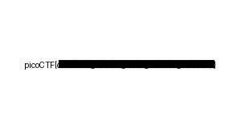

# endianness-v2 #
 
## Overview ##

300 points

Category: [Forensics](../)

Tags: `#forensics #endian`

## Description ##

Here's a file that was recovered from a 32-bits system that organized the bytes a weird way. We're not even sure what type of file it is.
Download it here and see what you can get out of it

## Approach ##

After trying various rotations and endian-swapping of various sizes, viewing the `challengefile` in a hex editor identified a `JPEG` image header in reverse byte order.

    $ hd challengefile
    00000000  e0 ff d8 ff 46 4a 10 00  01 00 46 49 01 00 00 01  |....FJ....FI....|
    00000010  00 00 01 00 43 00 db ff  06 06 08 00 08 05 06 07  |....C...........|
    00000020  09 07 07 07 0c 0a 08 09  0b 0c 0d 14 12 19 0c 0b  |................|

Where the [JPEG File Interchange Format (JFIF)](https://en.wikipedia.org/wiki/JPEG_File_Interchange_Format#File_format_structure) specifies,

    0xFF 0xD8   = SOI Segment (Start of Image)
    0xFF 0xE0   = JFIF APP0 marker
    .. etc

So writing a quick and dirty C program to endian swap the entire file, rewriting it to a new `challengefile.jpg` :

    #include <stdio.h>

    unsigned int endian_swap_word(unsigned int word)
    {
      unsigned int new_word = 0;

      new_word = (word >> 24) & 0xFF;
      new_word |= (word >> 8) & 0xFF00;
      new_word |= (word << 8) & 0xFF0000;
      new_word |= (word << 24) & 0xFF000000;

      return new_word;
    }

    int main(void)
    {
      FILE *in_fp = fopen("challengefile", "rb");
      FILE *out_fp = fopen("challengefile.jpg", "wb");

      unsigned int word;
      while(!feof(in_fp))
      {
        if (fread(&word, sizeof(word), 1, in_fp) > 0)
        {
          unsigned int swapped_word = endian_swap_word(word);

          fwrite(&swapped_word, sizeof(swapped_word), 1, out_fp);
        }
      }

      fclose(in_fp);
      fclose(out_fp);

      return 0;
    }

## Solution ##

Viewing the rewritten challenge file in an image viewer reveals the flag (redacted for the purposes of this write up)

