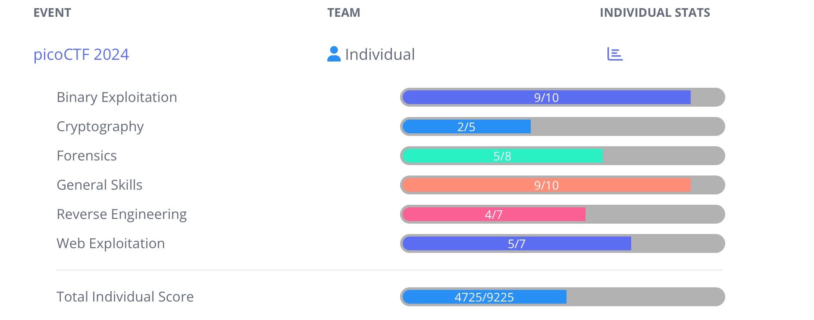

# picoCTF 2024

## Overview ##

I participated in the [picoCTF 2024](www.picoctf.org) competition as an individual competing in the Global category, organised by [Carnegie Mellon University](https://cmu.edu/), which ran from 13'th to 27'th March 2024 (local time). 

This is a write up of my progress and the challenges solved during the event.

## Pull Requests ##

As the purpose of this repository is to document my personal progress, capturing my approach and solutions identified, which may be of use to others and of future reference to myself, it doesn't make a lot of sense to accept pull requests for solutions I hadn't solved, sorry. I welcome comments or possible improvements to solutions to those challenges documented, but otherwise I recommend creating a similar repository of your own, which I can link to from here if desired.

## Progress ##

## Challenges ##

**This event write up is a work in progress (new solutions added as the write-ups are completed).**

As time permits I'll be adding further individual challenge write ups for all those marked as `(Solved)`, based on my notes taken during the event. Additionally there may be the odd challenge that I failed to solve but may want to document my progress, marked `(Unsolved - Progress Writeup)`.

  
Binary Exploitation (7 solutions)

* **[format string 0](Binary%20Exploitation/format%20string%200/format%20string%200.md) (Solved)**
* **[heap 0](Binary%20Exploitation/heap%200/heap%200.md) (Solved)**
* **[format string 1](Binary%20Exploitation/format%20string%201/format%20string%201.md) (Solved)**
* **[heap 1](Binary%20Exploitation/heap%201/heap%201.md) (Solved)**
* **[heap 2](Binary%20Exploitation/heap%202/heap%202.md) (Solved)**
* **[heap 3](Binary%20Exploitation/heap%203/heap%203.md) (Solved)**
* **[format string 2](Binary%20Exploitation/format%20string%202/format%20string%202.md) (Solved)**
* format string 3 (Solved)
* **[babygame03](Binary%20Exploitation/babygame03/babygame03.md) (Solved - WRITE UP IN PROGRESS)**
* high frequency troubles (Unsolved)

  
Cryptography (TODO solutions)

* interencdec (Solved)
* Custom encryption (Solved)
* C3 (Unsolved)
* rsa_oracle (Unsolved)
* flag_printer (Unsolved)

  
Forensics (TODO solutions)

* Scan Surprise (Solved)
* Verify (Solved)
* CanYouSee (Solved)
* Secret of the Polyglot (Solved)
* Mob psycho (Unsolved)
* endianness-v2 (Solved)
* Blast from the past (Unsolved)
* Dear Diary (Unsolved)

  
General Skills (TODO solutions)

* Super SSH (Solved)
* Commitment Issues (Solved)
* Time Machine (Solved)
* Blame Game (Solved)
* Collaborative Development (Solved)
* binhexa (Solved)
* Binary Search (Solved)
* endianness (Solved)
* dont-you-love-banners (Solved)
* SansAlpha (Unsolved)

  
Reverse Engineering (TODO solutions)

* packer (Solved)
* FactCheck (Unsolved)
* WinAntiDbg0x100 (Solved)
* Classic Crackme 0x100 (Solved)
* weirdSnake (Unsolved)
* WinAntiDbg0x200 (Solved)
* WinAntiDbg0x300 (Unsolved)

  
Web Exploitation (TODO solutions)

* Bookmarklet (Solved)
* WebDecode (Solved)
* IntroToBurp (Solved)
* Unminify (Solved)
* No Sql Injection (Solved)
* Trickster (Unsolved)
* elements (Unsolved)

Full solutions to the challenges are provided in the write ups, however the actual flag values are witheld.
