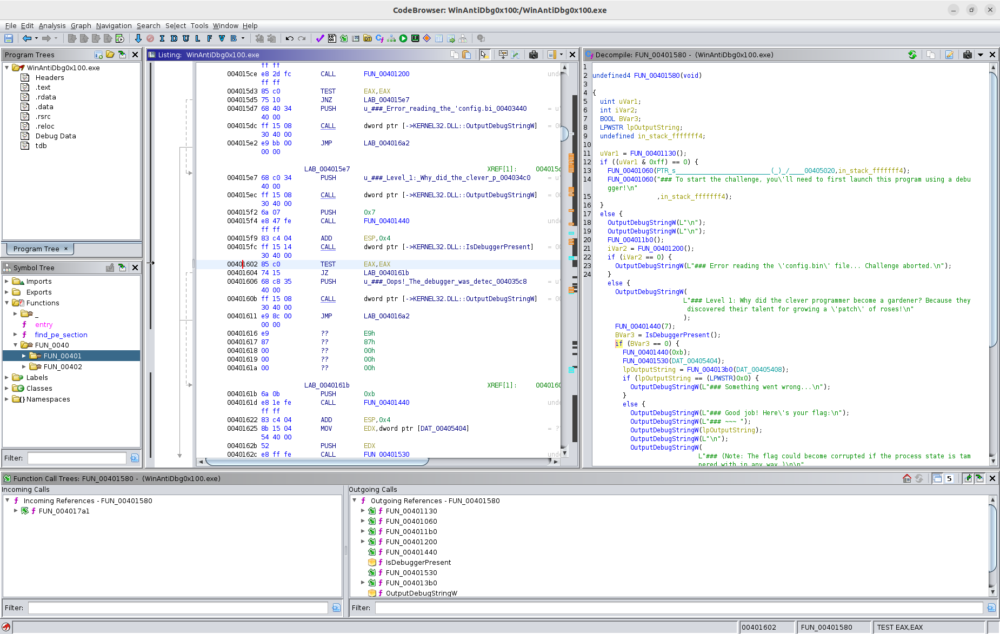

# WinAntiDbg0x100 #
 
## Overview ##

200 points

Category: [Reverse Engineering](../)

Tags: `#reverseengineering #windows #antidebug`

## Description ##

This challenge will introduce you to 'Anti-Debugging.' Malware developers don't like it when you attempt to debug their executable files because debugging these files reveals many of their secrets! That's why, they include a lot of code logic specifically designed to interfere with your debugging process.
Now that you've understood the context, go ahead and debug this Windows executable!
This challenge binary file is a Windows console application and you can start with running it using cmd on Windows.
Challenge can be downloaded here.

## Approach ##

Firstly installed [Microsoft WinDbg](https://learn.microsoft.com/en-us/windows-hardware/drivers/debugger/), running the challenge executable:

            _            _____ _______ ______  
           (_)          / ____|__   __|  ____| 
      _ __  _  ___ ___ | |       | |  | |__    
     | '_ \| |/ __/ _ \| |       | |  |  __|   
     | |_) | | (_| (_) | |____   | |  | |      
     | .__/|_|\___\___/ \_____|  |_|  |_|      
     | |                                       
     |_|                                       
      Welcome to the Anti-Debug challenge!
    ### Level 1: Why did the clever programmer become a gardener? Because they discovered their talent for growing a 'patch' of roses!
    ### Oops! The debugger was detected. Try to bypass this check to get the flag!

Disassembling `WinAntiDbg0x100.exe` in [Ghidra](https://ghidra-sre.org) and searching for references to the `"Oops!"` string (at `0x004035c8`) yields a single reference at `0x0401606` in `FUN_00401580()`, shown below.

`FUN_00401580()` calls the `IsDebuggerPresent()` WIN32 API function to determine if it's currently being debugged. This function returns a `BOOL`, zero (or `false`) indicating it is not being debugged.

The use of the return value can be seen in the Ghidra disassembly above via the `if/else` block, which translates to the assembly:

    TEST  EAX, EAX
    JZ    LAB_0040161b    # no debugger present code block

`EAX` by the C x86 call convention contains the return value of the `IsDebuggerPresent()` function. The `TEST` instruction performs a bitwise `AND` of the two operands (in this case they are both `EAX`). When not debugging `EAX` will be zero, hence the logical comparison results in the zero flag `ZF` being asserted. Such that the subsequent "Jump if Zero" (`JZ`) instruction will branch execution to this new destination.

## Solution ##

The `TEST` instruction is represented in binary via the opcodes `0x85 0xc0` as can be seen in the Ghidra disassembly.

We can patch this instruction to be `XOR  EAX,EAX` instead, resulting in the zeroing of `EAX` and assertion of the `ZF` flag, by modifying the opcodes to `0x33 0xc0`.

This was achieved via a hex editor, using the `Byte source offset` obtained from Ghidra for the `TEST` instruction, which was `0xA02`.

Running the patched challenge binary again we get:

           _            _____ _______ ______  
           (_)          / ____|__   __|  ____| 
      _ __  _  ___ ___ | |       | |  | |__    
     | '_ \| |/ __/ _ \| |       | |  |  __|   
     | |_) | | (_| (_) | |____   | |  | |      
     | .__/|_|\___\___/ \_____|  |_|  |_|      
     | |                                       
     |_|                                       
      Welcome to the Anti-Debug challenge!
    ### Level 1: Why did the clever programmer become a gardener? Because they discovered their talent for growing a 'patch' of roses!
    ### Good job! Here's your flag:
    ### ~~~ picoCTF{...........redacted.............}
    ### (Note: The flag could become corrupted if the process state is tampered with in any way.)

Where the actual flag value has been redacted for the purposes of this write up.
