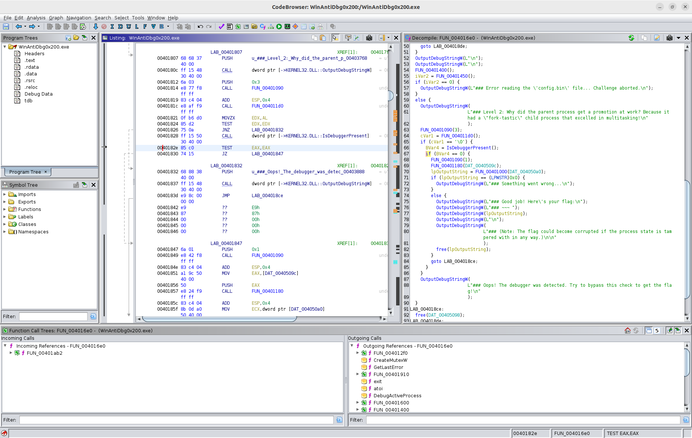

# WinAntiDbg0x200 #
 
## Overview ##

300 points

Category: [Reverse Engineering](../)

Tags: `#reverseengineering #windows #antidebug`

## Description ##

If you have solved WinAntiDbg0x100, you'll discover something new in this one. Debug the executable and find the flag!
This challenge executable is a Windows console application, and you can start by running it using Command Prompt on Windows.
This executable requires admin privileges. You might want to start Command Prompt or your debugger using the 'Run as administrator' option.
Challenge can be downloaded here.

## Approach ##

Running the challenge binary in [Microsoft WinDbg](https://learn.microsoft.com/en-us/windows-hardware/drivers/debugger/) that was ran as Administrator (right click), we get:

            _            _____ _______ ______  
           (_)          / ____|__   __|  ____| 
      _ __  _  ___ ___ | |       | |  | |__    
     | '_ \| |/ __/ _ \| |       | |  |  __|   
     | |_) | | (_| (_) | |____   | |  | |      
     | .__/|_|\___\___/ \_____|  |_|  |_|      
     | |                                       
     |_|                                       
      Welcome to the Anti-Debug challenge!
    ### Level 2: Why did the parent process get a promotion at work? Because it had a "fork-tastic" child process that excelled in multitasking!
    BasepIsRemovableMedia: Host device is removable, Shim cache deactivated
    ### Oops! The debugger was detected. Try to bypass this check to get the flag!

Disassembling `WinAntiDbg0x200.exe` in [Ghidra](https://ghidra-sre.org) and searching for references to the `"Oops!"` string (at `0x0403888`) yields a single reference at `0x0401832` in `FUN_004016e0()`, shown below.

Just like in [WinAntiDbg0x100](../WinAntiDbg0x100/WinAntiDbg0x100.md) we have the use of the Win32 API `IsDebuggerPresent()` function, which we can patch using the same method, refer to that write up for further details.

But before that we have some additional conditional logic, the `FUN_004011d0()` function is called and the return value is compared against `\0`.

    ...
    cVar1 = FUN_004011d0()
    if (cVar1 == '\0') {
    ...

This function spawns a new process and waits for it to exit as part of it's processing and debugger detection.

We can patch this conditional logic in a similar fashion.

## Solution ##

The checking of the return value from `FUN_004011d0()` can be seen in the following assembly snippet:

    0040181c  e8 af f9        CALL       FUN_004011d0
    00401821  0f b6 d0        MOVZX      EDX,AL
    00401824  85 d2           TEST       EDX,EDX
    00401826  75 0a           JNZ        LAB_00401832

Using the same method as previous, we can patch the `TEST  EDX,EDX` instruction to be a `XOR  EDX,EDX` instruction to zero the `EDX` register and assert the `ZF` flag, causing the "Jump if Not Zero" instruction to never be followed.

Patching the `0x85 0xd2` opcodes to `0x33 0xd2` translates to the `XOR` instruction. This was patched in a hex editor at byte offset 0xC24 as given by Ghidra.

Repeating the `IsDebuggerPresent()` patch from [WinAntiDbg0x100](../WinAntiDbg0x100/WinAntiDbg0x100.md) at byte offset 0xC2E, patching the `TEST  EAX, EAX` instruction to `XOR  EAX,EAX` we run the patched challenge binary again to see :

            _            _____ _______ ______  
           (_)          / ____|__   __|  ____| 
      _ __  _  ___ ___ | |       | |  | |__    
     | '_ \| |/ __/ _ \| |       | |  |  __|   
     | |_) | | (_| (_) | |____   | |  | |      
     | .__/|_|\___\___/ \_____|  |_|  |_|      
     | |                                       
     |_|                                       
      Welcome to the Anti-Debug challenge!
    ### Level 2: Why did the parent process get a promotion at work? Because it had a "fork-tastic" child process that excelled in multitasking!
    BasepIsRemovableMedia: Host device is removable, Shim cache deactivated
    ### Good job! Here's your flag:
    ### picoCTF{...........redacted.............}
    ### (Note: The flag could become corrupted if the process state is tampered with in any way.)

Where the actual flag value has been redacted for the purposes of this write up.
