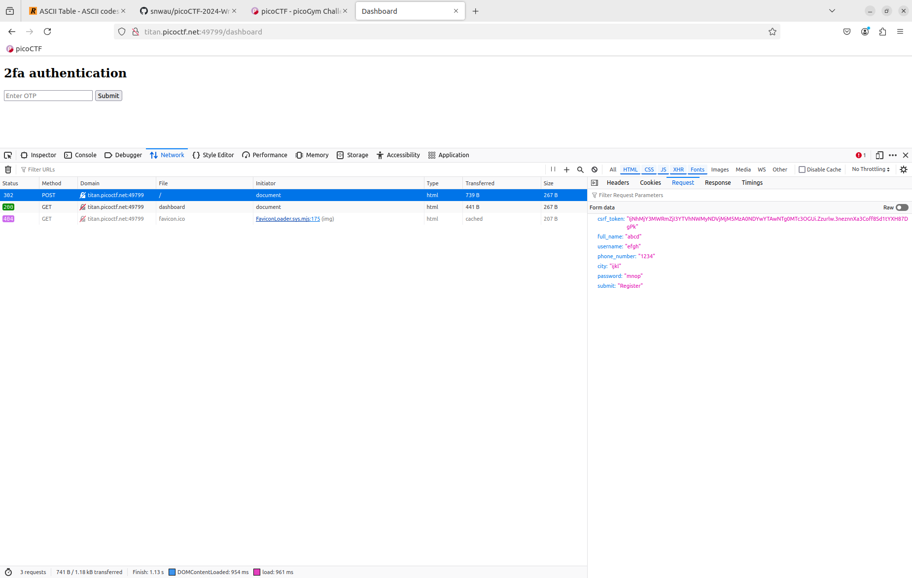
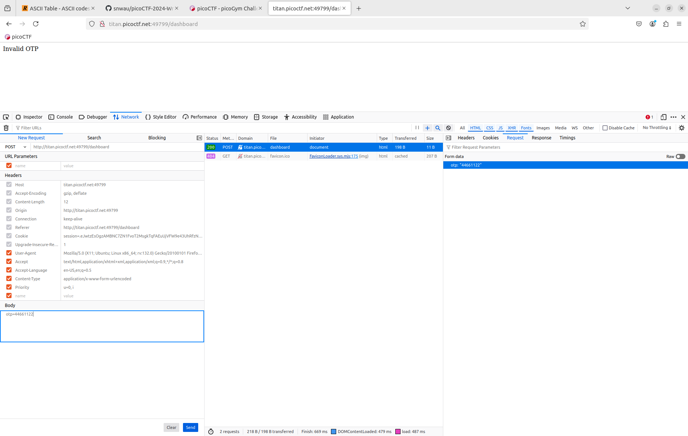
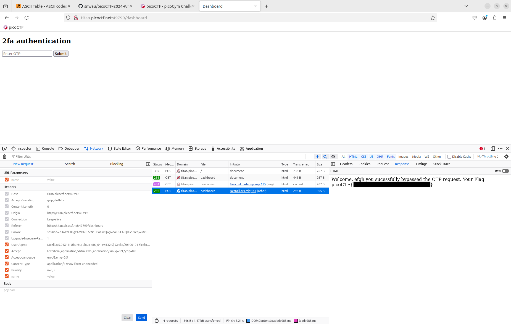

# IntroToBurp #
 
## Overview ##

100 points

Category: [Web Exploitation](../)

Tags: `#webexploitation #burpsuite #post`

## Description ##

Try here to find the flag

## Approach ##

I found the Network view of the built-in Web Development Tools in [Firefox](https://www.mozilla.org/en-US/firefox/new/) sufficient to complete this challenge without the need for [Burp Suite](https://portswigger.net/burp).

Opening the provided link in a new tab we are presented with a registration form.

Opening the Firefox Web Developer Tools and selecting the Network view, enter placeholder data in the registration form fields and press the 'Register' button.

The data from the form is `POST`'ed and a new form is displayed requesting two-factor authentication. 

Enter any value and press the 'Submit' button.

Another `POST` can be seen in the Network view with our two-factor authentication request. Our two-factor authentication request failed.

## Solution ##

Selecting the two-factor authentication `POST` request from the Network view, right-clicking on it to select the 'Edit and Resend' menu item.

Remove the `otp` parameter from the request and resend.

The response to the invalid request we created (missing the `otp` parameter) contains the challenge flag.

Where the actual flag value has been redacted for the purposes of this write up.
